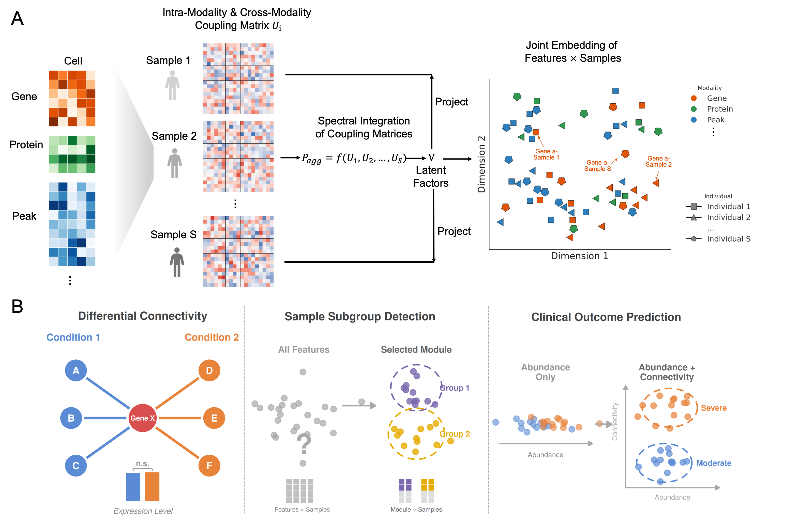

# MOSAIC: Unified Feature and Sample Joint Embeddings for Population-Scale Single-Cell Multi-Omics

<p align="center">
  
</p>

MOSAIC (**M**ulti-**O**mic **S**ample-wise **A**nalysis of **I**nter-feature **C**onnectivity) is a spectral framework that learns a high-resolution feature × sample joint embedding from population-scale single-cell multi-omics data. For each individual, MOSAIC constructs a sample-specific coupling matrix capturing complete intra- and cross-modality feature interactions, then projects all samples into a shared latent space via spectral integration. The resulting embedding represents each feature by its connectivity profile relative to all other features, enabling direct comparison of regulatory network topology across individuals.

MOSAIC supports three downstream applications:

- **Differential Connectivity (DC) Analysis**: identifies features whose regulatory networks are rewired across conditions, even when their abundance remains unchanged.
- **Unsupervised Subgroup Detection**: groups multi-modal features into coherent modules and tests whether specific modules delineate distinct patient subtypes.
- **Clinical Outcome Prediction**: leverages connectivity-derived features as a complementary signal to abundance-based analysis for improved disease classification.

**Documentation**: https://klugerlab.github.io/MOSAIC/

## Installation

```r
# install.packages("devtools")
devtools::install_github("KlugerLab/MOSAIC")
```

## Quick Start

```r
library(MOSAIC)

# --- Run MOSAIC embedding ---

# One modality (e.g. RNA only)
result <- run_MOSAIC(
  list(RNA = seurat_rna),
  assays = c("RNA"),
  sample_meta = "sample_id",
  condition_meta = "condition"
)

# Two modalities (e.g. RNA + ATAC)
result <- run_MOSAIC(
  list(RNA = seurat_rna, ATAC = seurat_atac),
  assays = c("RNA", "ATAC"),
  sample_meta = "sample_id",
  condition_meta = "condition"
)

# Three modalities (e.g. RNA + ATAC + ADT)
result <- run_MOSAIC(
  list(RNA = seurat_rna, ATAC = seurat_atac, ADT = seurat_adt),
  assays = c("RNA", "ATAC", "ADT"),
  sample_meta = "sample_id",
  condition_meta = "condition"
)

# --- Differential Connectivity Analysis ---
n_sample <- length(result$mosaic_embed_list)
dc_result <- run_DC_test(
  result$mosaic_embed_list,
  n_sample = n_sample,
  groups = result$annotation$Condition
)

# Compute empirical p-values against a shuffled null
shuffle_F <- unlist(shuffle_dc$F_stats_list)
pvalues <- sapply(
  unlist(dc_result$F_stats_list),
  function(x) calculate_empirical_pvalue(x, shuffle_F)
)

# --- Subgroup Detection ---
# Compute module-level sample similarity
sim_mat <- compute_module_similarity(
  result$mosaic_embed_list,
  feature_idx = which(feature_clusters == module_id)
)

# Test for balanced partition
partition <- find_partition_hclust(as.dist(1 - sim_mat))

# --- Visualization ---
plot_eigen(result$eigenvalues)

plot_mds_cluster(
  dc_result$similarity_matrix_list[[1]],
  title = "Feature Embedding",
  cluster = result$annotation$Condition
)
```

## Citation

If you use MOSAIC in your research, please cite:

> Lu, C., Kluger, Y., & Ma, R. MOSAIC: Unified Feature and Sample Joint Embeddings for Population-Scale Single-Cell Multi-Omics.
